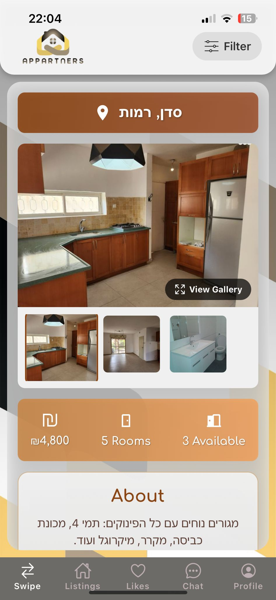

# Appartners


## 🏠 About

Appartners is a modern mobile application designed to revolutionize the apartment-sharing experience. The platform connects apartment owners with potential roommates through an intuitive, Tinder-like swiping interface, helping users find their ideal living situation based on compatibility, preferences, and lifestyle.

## ✨ Features

- **Smart Matching**: Swipe through potential apartments or roommates with our intuitive interface
- **Compatibility Scoring**: Algorithm that matches users based on lifestyle preferences and habits
- **Real-time Chat**: Communicate directly with potential roommates or apartment owners
- **Apartment Listings**: Create and manage detailed apartment listings with multiple images
- **User Profiles**: Comprehensive profiles highlighting preferences and living habits
- **Likes System**: Save and track your favorite apartments or potential roommates
- **Filter System**: Narrow down options based on price, location, and other preferences
- **Secure Authentication**: Robust user authentication and password recovery system

## 🛠️ Technology Stack

- **Frontend**: React Native, Expo
- **State Management**: Redux Toolkit
- **UI Components**: React Native Paper, React Navigation
- **Form Handling**: React Hook Form with Yup validation
- **Networking**: Axios for API requests
- **Real-time Communication**: Socket.io for chat functionality
- **Storage**: Async Storage for local data persistence
- **Authentication**: Secure token-based authentication with Expo Secure Store

## 📱 Screenshots

<div style="display: flex; flex-direction: row; flex-wrap: wrap; gap: 10px; justify-content: center;">
  
  
  
  
</div>

## 🚀 Getting Started

### Prerequisites

- Node.js (v14 or higher)
- npm or yarn
- Expo CLI

### Installation

1. Clone the repository:
   ```bash
   git clone https://github.com/yourusername/appartners.git
   cd appartners
   ```

2. Install dependencies:
   ```bash
   npm install
   # or
   yarn install
   ```

3. Start the development server:
   ```bash
   npx expo start
   # or
   yarn expo start
   ```

4. Open the Expo app on your mobile device and scan the QR code to launch the application.

## 🧩 Project Structure

```
appartners/
├── api/                  # API integration and services
├── assets/               # Static assets (images, fonts)
├── components/           # Reusable UI components
├── context/              # React Context providers
├── navigation/           # Navigation configuration
├── screens/              # Application screens
└── store/                # Redux store configuration
```

## 🚀 Production

The backend of Appartners is currently deployed on [Railway](https://railway.app), providing a reliable and scalable cloud infrastructure for API services, authentication, and real-time communication.

This setup allows users to interact with the app seamlessly, including account management, swiping, messaging, and apartment listings—all backed by live production APIs.

We chose Railway for its ease of deployment, CI/CD support, and excellent developer experience, enabling us to focus more on building features and less on infrastructure.


## 👥 Our Work

This project was developed by a team of four students as part of our final year capstone project in Software and Information Systems Engineering at Ben-Gurion University.

We aimed to solve the real-world challenge of finding compatible roommates and apartments in a user-friendly, modern way. The entire system—from UI/UX design to backend integration and real-time communication—was built from scratch using industry-standard tools and best practices.

Throughout the project, we applied agile development methodologies, conducted user testing, and iteratively improved the platform to deliver a smooth and intuitive user experience.

This app showcases our full-stack capabilities, teamwork, and passion for building impactful digital solutions.


## 📄 License

This project is licensed under the MIT License - see the LICENSE file for details.

